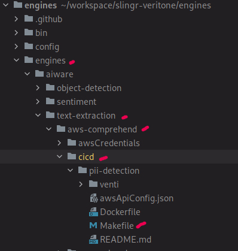
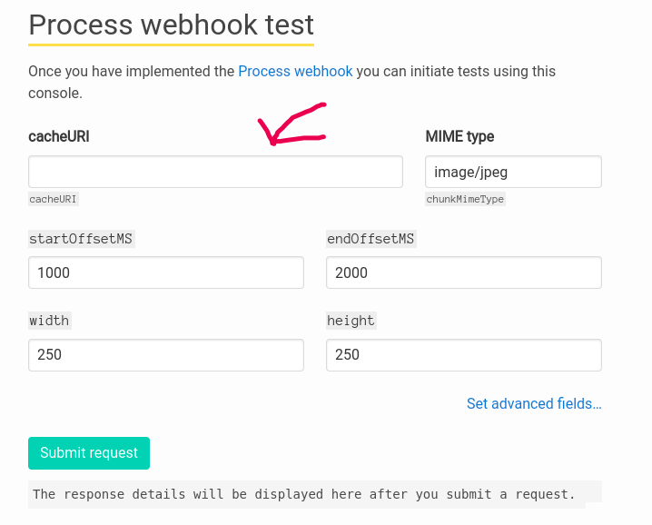

# Engines build

* Production -> **prod**
* Test -> **stage**

## Steps
1. select the environment : `stage/prod` 
    - **Stage**: https://developer.stage.us-1.veritone.com/overview
    - **Prod**: https://developer.veritone.com/overview

2. go to `Create New` and fill all the forms for the engine

3. check the review 

4. your engine will display a new and unique id, **save that id because it's important**\
e.g: `Engine ID: d170ec61-6898-4b20-89bd-0e3e4ed56b0b`

5. now, you cand go to CODE: 
    - `git pull` on github.com/veritone/engines
    - `git checkout -b` {Jira-Ticket-Name}-{EngineName}-{nameidentifier} \
    *e.g: `AWT-3864-aws-pii-detection-guido-testing`*

6. once you finally created and switched to te new branch, now go to:
`engines/engines/aiware/{type-of-engine}/aws-comprehend/cicd \

7. put the `ENGINE_ID` in:
    - Makefile
    - README.md

8. at this stage, you are OK. now there are several steps from here on

---

## Testing Engine

1. Open a terminal window, cd to the engine folder
2. Do a `make build`
3. Do a `make up-test`
4. Go to http://localhost:9090
5. You will notice that in the localhost:9090 site there is a `cacheURI` form
 \
You got to put the URI to download the test file for the current engine, it might be
a text-extraction sample, a biometric, etc.
6. The `MIME type` field contains the type for the file to analyze, in this case will be `text/plain`

---

## Building engine

### General build and publish
1. Open a terminal window, cd to the engine parent folder (./aws-comprehend)
2. Do a `make build`
3. Do a `make publish` to upload the latest image to registry

### Single build and publish:
1. Open a terminal window, cd to the engine service folder (./aws-comprehend/pii-detection)

If **General build and publish** was made, just skip to step 4.

2. Do a `make build`
3. Do a `make publish` to upload the latest image to registry
4. Do a `deploy-xxx` to the right environment *

#### * Deploy to stage
5. `make deploy-stage`
